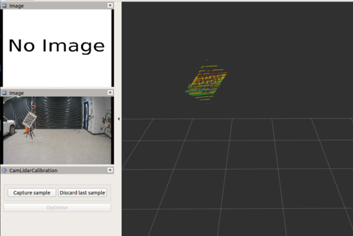
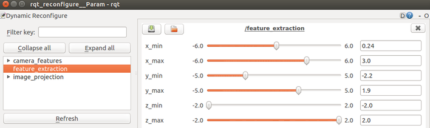

# Extrinsic Camera-LiDAR Calibration Tool

This is a calibration tool to find the extrinsic parameters that describes the relation between the lidar frame and camera frame. The image below shows our lidar-camera setup. 


## Getting Started

### Setup of Calibration Target

1. Prepare a rectangular chessboard printout, preferably with odd numbered grid dimensions (e.g. 9x7, 11x13)
2. Firmly attach the chessboard on a rigid, opaque, and rectangular board such that both their centres align and their edges remain parallel to one another. 
3. Choose a suitable stand that can mount the target with little to no protruding elements from the board's edges.
4. Mount the target on the stand such that it is tilted at an angle of 45-60 degrees with respect to the ground plane. 


### Pre-Requisites

- Ensure that the camera and the lidar have ros drivers such that the device output is a ROS message. 
- Make sure these pcl dependencies are installed: `ros-melodic-pcl-conversions` and `ros-melodic-pcl-ros`. They can be installed as follows. 

```
sudo apt-get install ros-melodic-pcl-conversions ros-melodic-pcl-ros
```

### Configuration Files

1. Specify the camera and lidar topic to subscribe to in both `launch/cam_lidar_calibration.launch` and the rviz config file `rviz/cam_lidar_calibration.rviz` (or you can change it in rviz GUI itself). You will also have to specify the fixed frame for RViz.

2. Edit the fields in `cfg/params.yaml`.

- feature_extraction-min/max-x,y,z: these are the bounding box dimensions of your calibration region. This doesn't have to be edited here; it can be dynamically configured in our provided rqt_reconfigure node.
- fisheye_model (true/false): type of camera. True for fisheye/equidistant, false for pinhole.
- chessboard-pattern_size: number of intersections of the chessboard, not number of squares (e.g. in our chessboard image above, it is a 9x7 grid with 8x6 intersections)
- chessboard-square_length (mm): size of grid square 
- chessboard-board_dimension (mm): size of the backing board (not the chessboard dimensions, but the board that the chessboard is pasted onto)
- chessboard-translation_error (mm): offset of the centre of chessboard from the centre of backing board
- cameramat (mm): 3x3 camera intrinsic parameters matrix
- distcoeff: camera distortion coefficients (the D matrix of your camera)
- image_size (pixels): resolution of the camera (e.g. 1920x1208 with length 1920 and breadth 1208)

Note: The feature_extraction fields with min/max of x,y,z axis can be dynamically set using the RQT Dynamic reconfigure tool which will be explained in the following steps.

## Usage

1. Launch the calibration tool: `roslaunch cam_lidar_calibration cam_lidar_calibration.launch` 

Launching the calibration tool will open up RViz and rqt_reconfigure tool. In RViz, there will be two Image windows: 1-camera topic, 2-camera features. The camera features image window will only be shown once the first sample has been taken. 

2. Place the chessboard facing the sensor pair. 

If you are doing offline calibration, make sure to run the bag with --pause so that RViz can capture the necessary transforms then start it by pressing space. 
E.g. `rosbag play --pause mybag.bag` 

3. Adjust the calibration region using our `feature_extraction` node in rqt_reconfigure such that only the chessboard target is visible as shown in the image below. 



The in rqt_reconfigure, feature_extraction variables correspond to the bounds of the 3D experimental region along the LiDAR's x,y,z axis:
- x_min \[rear], x_max \[front] with range of [-6.0, 6.0]
- y_min \[right], y_max \[left] with range of [-5.0, 5.0]
- z_min \[bottom], z_max \[top] with range of [-2.0, 2.0]





4. Click 'capture'. Make sure that the chessboard is correctly outlined. If it isn't, then discard and click capture again (or move the board and capture again). 

 


5. Place the board in another pose and press capture. Make sure to keep the board in the calibration region and to angle the board such that the normals of the different poses intersect. 

6. Repeat step 5 until a minimum of 3 poses are obtained. More poses can be captured for higher accuracy (8-9 poses yielded satisfactory results)

7. Click 'optimise'.

Extrinsic parameters will be displayed in both the commandline and RViz.

- In the commandline, the first 3 values are Euler rotation angles (pitch, roll, yaw) and last 3 for translation (x,y,z). 

- In RViz, the same values are displayed, except rotation angles are in Quaternion instead of Euler. 


## More Information

For more information, view the [calibration paper](https://arxiv.org/abs/1904.12433).

A video of the calibration process can be viewed [here](https://www.youtube.com/watch?v=GD2c3jLBDZU). 


